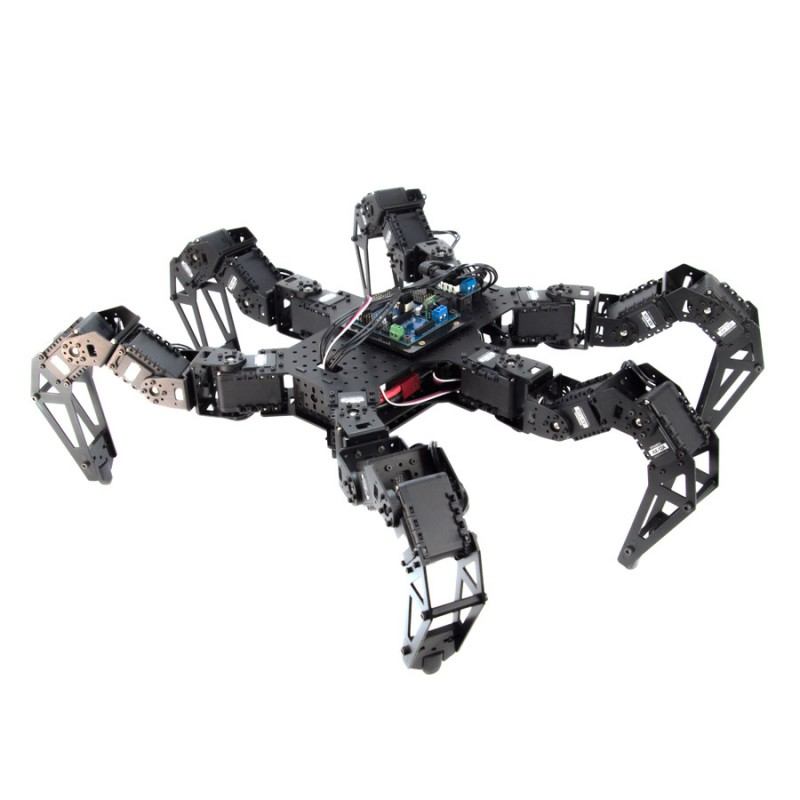

Robotics initiation class materials by Remi Fabre and Steve N'Guyen is licensed under a [Creative Commons Attribution 4.0 International License](https://creativecommons.org/licenses/by/4.0/).

# Robotics initiation
From the a DC motor to a walking Hexapod, an introduction to robotics.


# Requirements

## Every student should:

- Have a git account setuped and be confortable with git. Here is a [git tutorial](https://www.atlassian.com/git/tutorials/setting-up-a-repository) if needed.
- Clone this repository
```bash
git clone git@bitbucket.org:RemiFabre/robotics_initiation.git
```
- Install the Pypot library: https://github.com/poppy-project/pypot
```bash
python setup.py install --user
```

## Every team should:

- Create a private work repository with the name "robotics_initiation_teamX" where X is the ID of your team.
- Give repository access to all team members and the teacher. The state of the repository and the quality of the code will be taken into account for scoring.
- Add a README.md that explains how to use your work 
- Add a license ([cf CreativeCommons](https://creativecommons.org/choose/))
- Add a .gitignore (you can copy the one in this repository)

## Notes

Some files are encrypted because they contain the solutions to some of the tasks. The passwords will be shared as we move forward in class.
Of course, I'll forget the passwords then. Note to myself: look for "Passwords for robotics initiation class" in my mail.

To decrypt:
```
qpdf --password=ASmartPassw0rd --decrypt directKinematicSolutionProtected.pdf directKinematicSolutionProtected.pdf
```

To encrypt:
```
qpdf --encrypt ASmartPassw0rd ASmartPassw0rd 256 -- directKinematicSolution.pdf directKinematicSolutionProtected.pdf
```